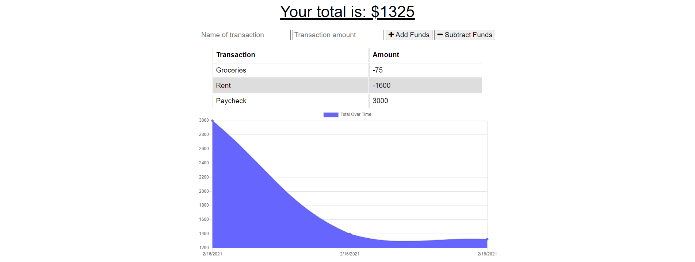

# Progressive-Budget-

## **Description**

This is a budget tracking system that allows the user to add expenses and deposits to thier budget. Through a line graph, the app displays the user's transactions as their budget is spent and added to it. The application has an offline access functionality.
I synced the app through indexDB so that the user can continue to use the app if they are offline. When entering transactions offline, the transactions will be added to the total and then be stored with MongoDB when the application comes back online. My project is deployed through heroku. 

The application uses Express.JS for establishing API routes and uses MongoDB as it's database. My frontend is built upon HTML, CSS, Javascript and chart.js. 

 

## Table of Contents

* [Installation](#Installation)
* [Screenshot](#screenshot)
* [Link](#link)
* [License](#license)
* [Questions](#questions)

## Installation

      To work with the application from the backend:
            1. In your terminal for the project, run `npm i` to install necessary NPM packages.
            2. Run `npm run start` to start the server.

## **Screenshot**

Here is a photo of the Progressive Budget application.

# Link
Look at the live version through Heroku [here.](https://offline-finance-tracker.herokuapp.com/)

## **License**

## **Questions**

Please contact <renteriamp96@gmail.com>. if you have any questions and be sure to check out my other projects!